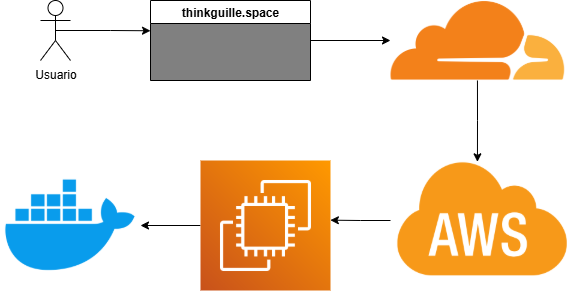

# deploy-con-docker-y-aws

# 🚀 Deploy con Docker y AWS EC2

Este repositorio contiene una guía paso a paso para **desarrollar, dockerizar y desplegar un proyecto** en la nube utilizando servicios de AWS (EC2), Docker y configuración de dominio con HTTPS.

Incluye documentación básica y avanzada para cualquier desarrollador que quiera aprender a lanzar aplicaciones desde cero hasta producción.

---

## 📘 Contenido del repositorio

| Archivo | Descripción |
|--------|-------------|
| [`Cómo desplegar en docker.pdf`](./Cómo%20desplegar%20en%20docker.pdf) | Guía completa paso a paso sobre cómo dockerizar y desplegar en AWS |
| [`A02 - DOCKER CHEAT SHEET.pdf`](./A02%20-%20DOCKER%20CHEAT%20SHEET.pdf) | 25 comandos básicos de Docker para principiantes |

---

## 🔧 Tecnologías utilizadas

- 🐳 **Docker**
- ☁️ **AWS EC2**
- 🌐 **Cloudflare (DNS + Proxy)**
- 🐧 **Ubuntu**
- 🔐 **Certbot + Let's Encrypt**
- 🔀 **Nginx como Proxy inverso**
- 🧩 **DockerHub (para imágenes)**

---

## 🛠️ Qué aprenderás

✅ Cómo crear un Dockerfile básico  
✅ Cómo construir y subir tu imagen a DockerHub  
✅ Cómo levantar una instancia EC2 en AWS  
✅ Cómo configurar un dominio con Cloudflare  
✅ Cómo usar Nginx como proxy inverso  
✅ Cómo instalar y configurar SSL con Certbot  
✅ Cómo exponer tu aplicación en producción

---

## 📷 Diagrama del flujo



*(Puedes agregar una imagen aquí si subes alguna al directorio `/assets`)*

---

## 💡 Requisitos previos

- Cuenta activa en [Docker Hub](https://hub.docker.com/)
- Cuenta en [AWS](https://aws.amazon.com/) (con EC2 habilitado)
- Conocimiento básico de terminal / CLI
- Un dominio (opcional pero recomendado, puede usarse Cloudflare)

---

## 📤 Cómo usar esta guía

1. Clona este repositorio:
   ```bash
   git clone https://github.com/GuillermoSM33/deploy-con-docker-y-aws.git
   cd deploy-con-docker-y-aws

